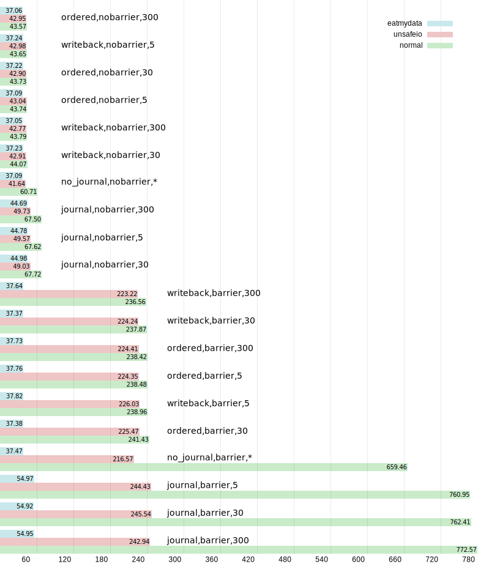

# dpkg-benchmark
A set of scripts to benchmark package installation in different conditions. It uses `force-unsafe-io` option and libeatmydata
to gain more speed from dpkg. It is suitable both for HDD and SSD (supports TRIM).

Generates a pretty graph showing the amount of time needed for packages to be installed (in seconds).




## Installation

No installation required. However you need some dependencies:

* `debootstrap`
* `bc` for floating point calculations
* Python 3.X
* Gnuplot


## Usage

First prepare an archived container using debootstrap (run as root)

```
# mkdir stretch
# debootstrap stretch ./stretch http://mirror.yandex.ru/debian
# tar cpJf stretch-deboostrapped.tar.xz --one-file-system -C stretch .
```

Second, find or create an empty disc partition for benchmarking. It will be formatted many times, so ensure there is no important
data out there! Let it be `/dev/sdXY`.

You are now ready to launch a benchmark (run as root)

```
# ./dpkg-benchmark.sh stretch-deboostrapped.tar.xz /dev/sdXY
```

This will create `dpkg-benchmark.sdXY.log` file with time values (real, user, sys).

Average raw data, sort it and convert to convinient format for Gnuplot.

```
$ ./benchmark-analyze.py dpkg-benchmark.sdXY.log
```

This will create `normal`, `unsafeio` and `eatmydata` files.

Finally create a nice graph `plot.svg`.

```
$ ./draw.plt
```


## Fine-tuning

* You can adjust the number of each test repetitions in `RUNS_NUM` variable in `dpkg-benchmark.sh`.
* A set of packages to be installed is stored in `PACKAGES` variable.
*  `dpkg-benchmark.sh` currently supports only ext4 filesystem. It's possible to add other filesystems support with different
mount parameters if needed.
* It's possible to heavily customize the graph. Just read carefully `draw.plt` and experiment with constants.
